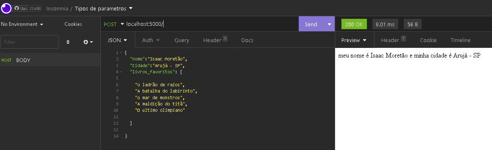

<h1 align="center">
  Estudando <b>NodeJS</b>
</h1>

  Esse é um projeto feito para meu aprendizado pessoal, o inicio dos meus estudos em NodeJs,
  com <b>Apis, get, put, post, delete e parametros na requisição</b>, usando a plataforma de estudos Discover <b>Rocketseat</b>

 
